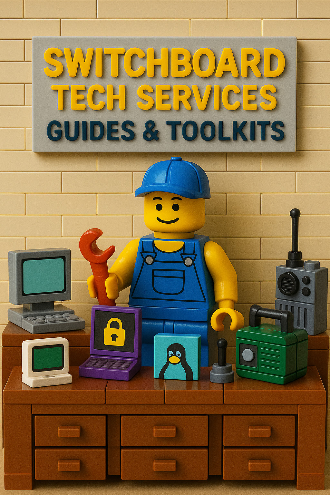

# Guides and Toolkits

Switch Board Tech Services isn't just about fixing computers and general electronics. I also write guides and references on various subjects to help in various tasks: Such as diagnosing hardware / software issues, Linux installation help, and more. 

---

### 🧰 [Kirksville Computer Repair Guide](/guides/kirksville-computer-repair-guide/)
Practical advice for keeping your computer running like new.  
Includes posts on speeding up laptops, backups, and smart repair habits.

### 🔒 [Privacy and Security Toolkit for Kirksville Residents](/guides/privacy-and-security-toolkit-for-kirksville-residents/)
Step-by-step privacy tips and open-source tools to protect your data online and offline.

### 🐧 [Open-Source Localism in Kirksville](/guides/open-source-localism-in-kirksville/)
How free and open-source software helps small towns save money, build skills, and stay self-reliant.

### ⚡ [Offline and Resilient Tech Toolkit](/guides/offline-resilient-tech-toolkit/)
A down-to-earth look at keeping tech running without the cloud — LoRa radios, backups, and off-grid resilience.

---

Explore the guides above to dive deeper — or scroll below for the full index of articles.
