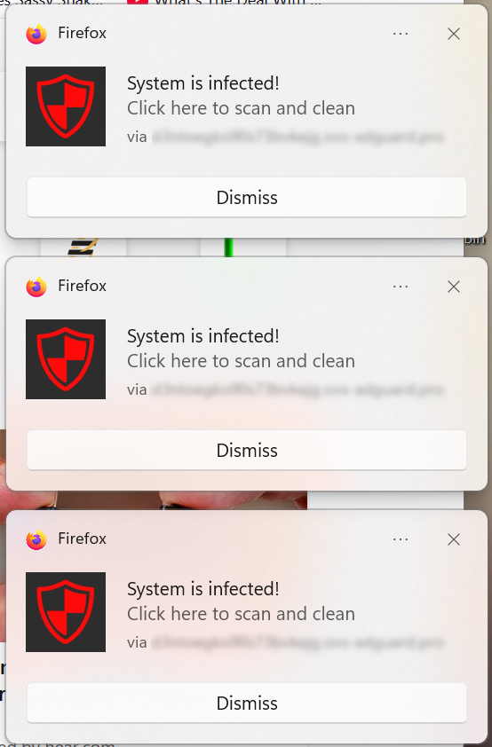
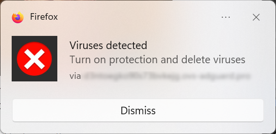
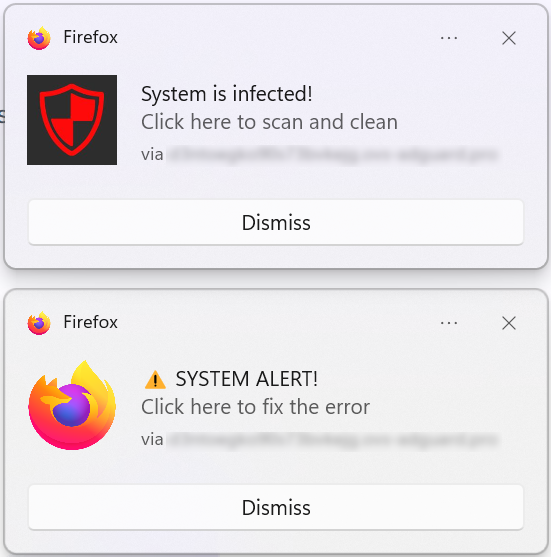

Today I helped a Kirksville user who swore their system was under attack.  
Three red-shield pop-ups screamed *“System is infected!”* — all pointing to a domain like `d3n7oed9x5adbcxsyz [dot] ows-adsguard [dot] pro`.  
Looks official, right? Except the domain name sounded like a cat ran across the keyboard.

After some quick sleuthing, it turned out not to be a virus at all — but a **browser notification scam**.  
Somewhere along the line, this website had convinced the user to *“allow notifications.”*  
That’s all it takes: one click of misplaced trust, and suddenly Firefox is allowed to throw fake security alerts straight to your desktop — even when you’re not browsing.

Here is a sampling of the alerts seen:

It was spammy [AF](https://www.urbandictionary.com/define.php?term=af). Very aggressive. They pop up as fast as you can close them. 

---

### What’s really going on

This isn’t a real antivirus message; it’s **social engineering**.  
Scammers register random-letter websites that sound semi-technical, then beg for permission to send notifications.  
Once allowed, they spam you with alerts that look like operating system warnings.  
The goal?  
Get you to **click their fake “Scan Now” buttons**, which lead to ad farms, shady “cleanup tools,” or outright malware downloads.

It’s a clever trick — they’re not *hacking* your computer; they’re just abusing a browser feature you willingly turned on.

---

### The fix (and how to stay clean)

1. In Firefox, go to **Settings → Privacy & Security → Permissions → Notifications**.  
   Remove any site with a gibberish domain name, and check “Block new requests.”  
2. Clear cache and cookies for good measure.  
3. If you didn’t download anything, congratulations — you’re not infected.  
4. If you *did* click something… well, now’s a good time for a full scan with Windows Defender or Malwarebytes.

---

### Final thoughts

This scam works because it *feels* like your system is talking to you — but it’s really a random web page yelling from the corner of the internet.  
Kirksville folks: if your computer suddenly says it’s infected, take a breath before you panic-click.  
It might just be another browser notification pretending to be important.

If you need help cleaning up stuff like this — or you just want your computer to stop shouting at you — I do **honest virus and malware fixes here in Kirksville**.  
No scare tactics, no pop-ups, just real repairs.
