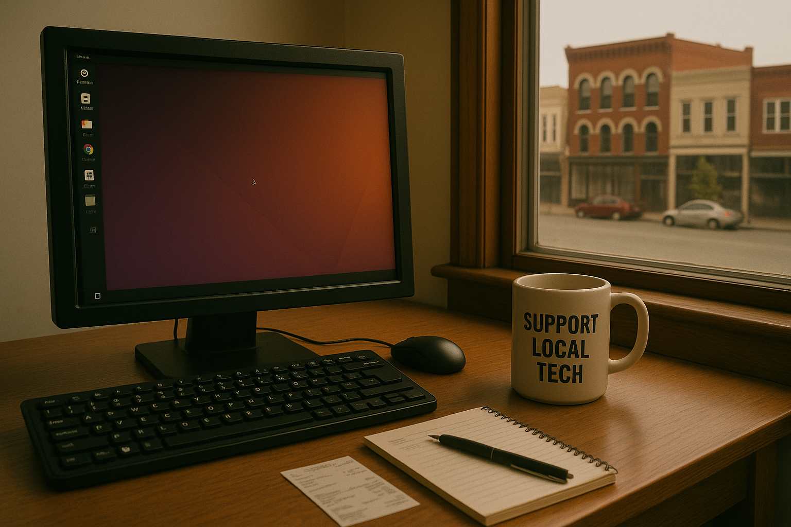

Running a business in Kirksville — or anywhere in Northeast Missouri — takes grit. Margins are thin, overhead is stubborn, and the economic landscape keeps shifting underfoot. Over the past decade, many local shops and service providers have shut their doors, not for lack of effort, but because the math simply stopped working.

This two-part report looks at both sides of that equation. First, it outlines what’s squeezing local businesses — from rising software costs and online competition to shrinking populations and pandemic aftershocks. Then, it explores how small, practical shifts — like adopting Linux and open-source tools — can cut thousands in recurring costs each year.

It’s not a sales pitch. It’s a realistic plan for keeping local businesses alive, resilient, and independent in a region that deserves more survivors than statistics.

## How to Save Thousands in Software / Computer Operating Costs

### Office Suites (Microsoft Office vs LibreOffice)

Microsoft 365 requires a paid subscription ranging from $72 to $384 per user per year depending on the plan ([source](https://www.thebusinessachiever.com/libreoffice-vs-microsoft-365-can-open-source-beat-the-giant/)). LibreOffice is entirely free and open-source, and it includes alternatives to Word, Excel, and PowerPoint. While complex documents with advanced formatting might not translate perfectly, most documents work fine ([source](https://www.thebusinessachiever.com/libreoffice-vs-microsoft-365-can-open-source-beat-the-giant/)).

**Savings Example**: A 3-user office spending $72/year per user could save $216–$1,000 annually by switching to LibreOffice.

### Creative/Design Tools (Adobe CC vs GIMP, Inkscape, etc.)

Adobe Creative Cloud All-Apps subscriptions cost about $600/year per user ([source](https://www.sdmfoundation.org/2025/05/21/free-alternatives-to-adobe-creative-cloud/)). Free tools like GIMP and Inkscape can handle most image editing and vector design tasks, replacing Photoshop and Illustrator for $0 ([source](https://www.sdmfoundation.org/2025/05/21/free-alternatives-to-adobe-creative-cloud/)).

**Savings Example**: One designer switching from Adobe CC to open-source tools saves $600 annually.

### Productivity Tools (Antivirus and Others)

Windows PCs usually require antivirus suites costing $100–$200 per device annually ([source](https://www.security.org/antivirus/best/business/)). Linux users typically don’t need paid antivirus software and instead use system permissions or free tools like ClamAV ([source](https://linuxsecurity.com/news/security-trends/antivirus-linux)).

**Savings Example**: A 5-device office might save $500 or more yearly by eliminating antivirus costs.

---

## Extending Hardware Life with Linux

### Run on Older PCs

Linux distributions are optimized to run on aging hardware, enabling businesses to extend the usable life of 5–10-year-old machines ([source](https://http-download.intuit.com/http.intuit/CMO/qbes/resources/pdfs/QuickBooks_Enterprise_Solutions_Linux_Advantage.pdf)).

### Avoid Windows License Costs

A typical Windows OEM license costs $100–150 per machine. Linux has no licensing fees, which translates to more savings per device.

### New PC Costs

A mid-range business desktop costs $400–800 ([source](https://www.business.org/finance/cost-management/much-computer-cost/)). If Linux adds 1–2 years to a computer’s usable life, businesses can defer those costs substantially.

**Savings Example**: Delaying the purchase of one $500 PC and avoiding its Windows license can save ~$600 in a given year.

---

## The Numbers 

### Example: Total Savings in a 1–5 PC Office

- **Office Suite**: ~$1,150/year saved with LibreOffice.
- **Creative Software**: $600/year saved switching from Adobe to GIMP/Inkscape.
- **Antivirus**: ~$300–500/year saved by dropping Windows antivirus tools.
- **Windows Licenses**: $300 saved (3×$100) in license costs.

**Total Estimate**: A 3-PC office could save **~$2,350+/year**, and a 5-PC office could easily save **$3,000–$5,000 annually** depending on current setup.

---

### Context: Rural Missouri and Midwest Margins

In areas like Kirksville, MO (median household income ~$56,500; [source](https://datausa.io/profile/geo/kirksville-mo-31000US28860)), every business expense matters. In low-margin environments, eliminating recurring software fees can materially improve sustainability.

One small-town case study outside Missouri reported successfully extending hardware life and avoiding upgrades by switching to Ubuntu ([source](https://richardscomputerbarn.ca/2024/11/27/5-benefits-of-switching-to-linux/)). These lessons apply directly to small businesses across the Midwest.

---

### Trade-offs and Considerations

- **Compatibility**: LibreOffice generally handles Word/Excel files, but very complex documents or VBA macros may not render perfectly ([source](https://www.thebusinessachiever.com/libreoffice-vs-microsoft-365-can-open-source-beat-the-giant/)). Some industry-specific apps don’t run natively on Linux.
- **Workarounds**: Many Windows-only tools can be run using Wine or virtualization ([source](https://richardscomputerbarn.ca/2024/11/27/5-benefits-of-switching-to-linux/)). Cloud platforms like QuickBooks Online or Google Workspace are OS-neutral.
- **Learning Curve**: Linux desktop environments like Mint and Ubuntu are user-friendly, but businesses should expect a short training phase. Many users report quick acclimation ([source](https://http-download.intuit.com/http.intuit/CMO/qbes/resources/pdfs/QuickBooks_Enterprise_Solutions_Linux_Advantage.pdf)).
- **Support**: Businesses should partner with a Linux-proficient IT provider (like Switchboard Tech Services) to handle updates and troubleshooting.
- **Feature Gaps**: Adobe and Microsoft still lead in some niche features or integrations. For standard productivity and design tasks, open-source software is sufficient ([source](https://www.sdmfoundation.org/2025/05/21/free-alternatives-to-adobe-creative-cloud/)).

---

### Findings

Switching to Linux and open-source software isn’t just a philosophical stance — it’s a practical business move. In a small office with 1–5 computers, the annual savings can range from **$2,000 to over $5,000**, without factoring in hardware savings or freedom from forced upgrades. In a place like Kirksville — where every dollar counts — this can mean the difference between scraping by and building a reserve.

**Sources**:
- [LibreOffice vs. Microsoft 365](https://www.thebusinessachiever.com/libreoffice-vs-microsoft-365-can-open-source-beat-the-giant/)
- [Free Alternatives to Adobe CC](https://www.sdmfoundation.org/2025/05/21/free-alternatives-to-adobe-creative-cloud/)
- [Security.org Business Antivirus Report](https://www.security.org/antivirus/best/business/)
- [Linux Security on Desktops](https://linuxsecurity.com/news/security-trends/antivirus-linux)
- [QuickBooks Linux Advantage (PDF)](https://http-download.intuit.com/http.intuit/CMO/qbes/resources/pdfs/QuickBooks_Enterprise_Solutions_Linux_Advantage.pdf)
- [Business Computer Cost Guide](https://www.business.org/finance/cost-management/much-computer-cost/)
- [Kirksville, MO Demographics](https://datausa.io/profile/geo/kirksville-mo-31000US28860)
- [Richard’s Computer Barn: 5 Linux Benefits](https://richardscomputerbarn.ca/2024/11/27/5-benefits-of-switching-to-linux/)
- [Open Source Value at Harvard Business School](https://www.library.hbs.edu/working-knowledge/open-source-software-the-nine-trillion-resource-companies-take-for-granted)



## Why Businesses Are Closing in Kirksville 



For a closer look at the economic and practical factors that have driven many Kirksville businesses to close over the past decade and a half, see the following analysis:

### 1. Rise of E-Commerce and Big-Box Competition

The shift in shopping behavior over the past decade has heavily impacted local businesses. Herb Sieren, a downtown Kirksville clothier, attributed the decline to the "evolution of the internet" ([KTVO](https://ktvo.com/news/local/long-time-heartland-business-to-close-its-doors-august-5)). Online shopping and big-box stores have pulled customers away from small shops.

Local case: the Sears Hometown store in Kirksville closed in 2017 after sales dropped below the level needed to pay basic expenses ([KTVO](https://ktvo.com/news/local/sears-hometown-store-in-kirksville-closing)). National chains have also failed to gain traction; both Goody's and its successor, Gordmans, closed after brief runs ([KTVO](https://ktvo.com/news/local/kirksville-gordmans-to-close-after-just-over-a-year-in-business)).

### 2. High Overhead vs. Thin Margins



Many small businesses run close to the edge. The longtime Westlake Ace Hardware will close in 2025, with corporate citing high rent and low profitability ([KTVO](https://ktvo.com/news/local/westlake-ace-hardware-in-kirksville-closing-for-good-in-october-06-09-2025-store-closure-northeast-missouri-longtime-business-shutting-its-doors-multiple-employees-affected-job-loss-economic-development)).

The same pattern affected Sears Hometown: insufficient revenue to cover rent and utilities ([KTVO](https://ktvo.com/news/local/sears-hometown-store-in-kirksville-closing)). Some landlords keep rents high to offset costs or wait for more profitable tenants, leading to persistent vacancies ([Strong Towns](https://archive.strongtowns.org/journal/2025/5/22/whats-with-the-vacant-storefronts-8-reasons-for-empty-commercial-spaces)).

### 3. Demographics and Local Market Limits

Kirksville and surrounding areas have seen **declining populations**, reducing the customer base. Adair County dropped ~4% from 2010 to 2017 ([UM Extension](https://extension.missouri.edu/media/wysiwyg/Extensiondata/Pub/pdf/miscpubs/mx0055.pdf)). The region suffers from out-migration and low in-migration, particularly among young adults.

Truman State University’s enrollment fell from 6,300 in 2016 to 4,600 by 2021 -- a 27% drop ([Kirksville Daily Express](https://www.kirksvilledailyexpress.com/stories/truman-fall-enrollment-has-104-percent-increase-in-new-students,62), [Truman Review](https://trumanreview.truman.edu/article/readyforwhatsnext/)). This directly impacts foot traffic and spending downtown.

A city study found downtown Kirksville’s retail capacity exceeds local demand by over $100,000 annually ([Mo State Parks Report](https://mostateparks.com/sites/mostateparks/files/Downtown%20Kirksville%20Report.pdf)).

### 4. The Shock of COVID-19



The pandemic caused widespread disruption. Lockdowns, capacity limits, and customer hesitancy all took a toll. JCPenney, a downtown fixture since 1925, closed in 2020 during the company’s bankruptcy. COVID “took a giant toll” according to company reps ([Missourinet](https://www.missourinet.com/2020/06/05/bankrupted-jcpenney-announces-missouri-store-closings)).

Sieren’s Palace had a buyer lined up in 2020, but they backed out due to COVID uncertainty ([KTVO](https://ktvo.com/news/local/long-time-heartland-business-to-close-its-doors-august-5)). Other business owners used the crisis as a pivot point for retirement or closure.

By late 2020, local leaders warned that many businesses were still in danger of closing permanently ([KTVO](https://ktvo.com/topic/David%20Petersen)). Vacancy visibly worsened during this period.

### 5. Examples of Local Closures

- **Sieren’s Palace (2020)** – Closed after a failed sale during COVID; longtime owner cited decades of pressure from online retail.
- **Sears Hometown (2017)** – Closed due to inability to meet basic costs.
- **Gordmans (2020)** – Closed during parent company’s COVID-era bankruptcy.
- **JCPenney (2020)** – Closed after 95 years in Kirksville.
- **Westlake Ace Hardware (2025 planned)** – Will close due to high rent and low profit margins.

### 6. Broader NEMO Trends

This isn’t unique to Kirksville. Small towns across Northeast Missouri have seen economic decline from out-migration, aging populations, and declining industries. Most counties in the region are shrinking ([UM Extension](https://extension.missouri.edu/media/wysiwyg/Extensiondata/Pub/pdf/miscpubs/mx0055.pdf)).

Even stable employers are leaving. Hollister Inc. will close its Kirksville plant in 2025, eliminating 75 jobs ([KTVO](https://ktvo.com/news/local/hollister-incorporated-to-close-kirksville-plant-by-end-of-2025)).

Pandemic-era shutdowns also hit nearby towns hard. In some Midwestern areas, commercial vacancy doubled by 2022 ([ABC Chicago](https://abc7chicago.com/post/shopping-chicago-whats-being-done-fill-empty-storefronts/14973447/)).

---

Together, these trends reveal a regional system under pressure. Business closures are the symptom -- not the disease. Population loss, global competition, and economic shocks have all made small business survival in Northeast Missouri increasingly fragile.

