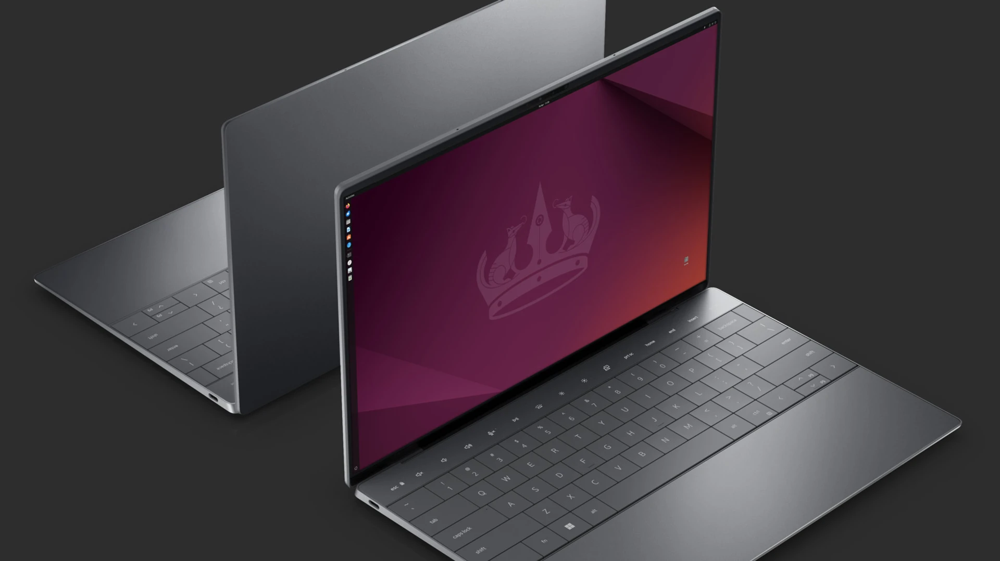

## I Am Kirksville’s Linux Guy

If your computer’s slowing down, freezing, or begging for upgrades, it might not be your hardware’s fault — it’s the software.  
I help people around Kirksville keep their technology useful with **Linux**, the open-source operating system that quietly runs most of the world’s technology.  
This isn’t a sales pitch; it’s just what I do here in town.

> "If your computer’s groaning like a tractor in February, I can tune it up."

---

## The Way We Actually Use Computers Has Changed

These days, about **70–80% of everyday computer work happens inside a web browser** — email, documents, forms, banking, scheduling, even video meetings.  
For that kind of work, the operating system underneath doesn’t matter much anymore.

Unless you’re gaming or doing heavy design work, **Linux already does everything you need**: it’s fast, secure, and doesn’t interrupt you with updates or subscriptions.

---

## Why Linux Works So Well

Linux isn’t a niche experiment — it’s the **operating system of the web**.  
Almost every major website, cloud server, and router runs on it because of its reliability and structure.  
That same dependability makes it a solid everyday system for home, office, and classroom use.

- Stable, fast, and low-maintenance  
- Free from licenses and forced upgrades  
- Resistant to malware and ransomware  
- Comes with full-featured office tools, browsers, and printers that just work  
- Lightweight versions can revive older computers that Windows no longer supports  

A ten-year-old laptop can still be a perfectly capable email and document machine under Linux.  
That keeps useful computers out of the landfill — and **keeps tech budgets in Kirksville** instead of subscription drains elsewhere.

---

## How I Help

I’m not a distant consultant — I’m local.  
When you call, you’re reaching someone who actually knows the hardware, the software, and the town.

- Installing and configuring Linux systems for homes, schools, and small businesses  
- Refurbishing older PCs so they run like new  
- Teaching people how to use open-source tools confidently  
- Offering repairs and real troubleshooting — not call-center scripts  

---

## Where Linux Fits in a Town Like Ours

Small towns rely on their tech more than ever, but they don’t need to rely on corporate ecosystems.  

- **City offices** that mostly handle documents and records  
- **Local shops** running browser-based sales systems  
- **Families** who just need safe, fast computers for homework and bills  

In places like Kirksville, reliability matters more than branding — and Linux delivers that quietly, day after day.

---

## Looking Ahead

Technology shouldn’t feel distant or disposable.  
It should be something we understand and maintain — like any other tool in town.  
That’s what I’m here for: helping Kirksville make the most of what it already has.

If you’re curious about Linux, have a slow machine, or just want to talk options, I’m nearby and happy to help.

**Switchboard Tech Services — Kirksville, Missouri**  
Local, sustainable, open.

---

## Bonus: A Few Things You Probably Didn’t Know About Linux

- **It runs almost everything you touch.**  
  About **96% of the world’s top one million web servers** use Linux. You use it every day without noticing.  

- **Your phone runs Linux.**  
  Android is built on the Linux kernel — every text, photo, and app relies on it.  

- **NASA trusts it.**  
  The **International Space Station** runs Debian Linux for stability and security. It’s literally orbit-tested (in a swimming pool).  

- **Supercomputers depend on it.**  
  All **500 of the world’s fastest supercomputers** run Linux. Every single one.  

- **It’s everywhere you can’t see.**  
  ATMs, routers, TVs, the stock exchange, and even air-traffic systems use it daily.  

- **Even Microsoft uses it.**  
  Nearly **half of Microsoft Azure’s servers** run on Linux because it’s that efficient.  

- **It’s free, forever.**  
  Open source means anyone can inspect, modify, and share it — which is why it’s trusted by scientists, engineers, and governments worldwide.

See [https://ubuntu.com/desktop](https://ubuntu.com/desktop)



---

