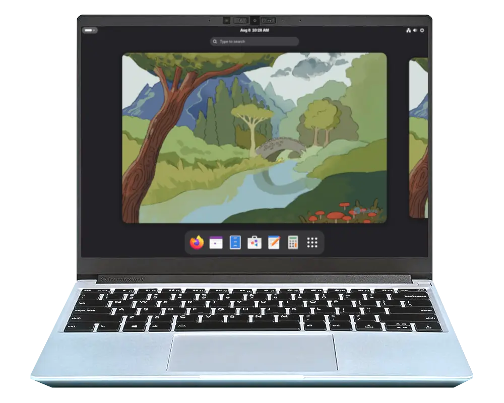
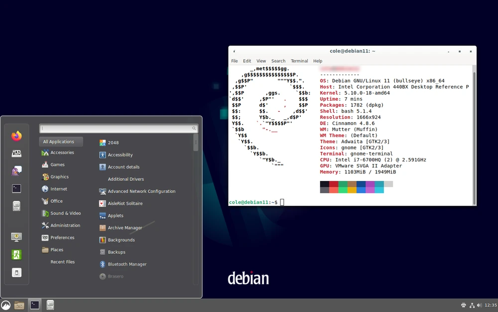
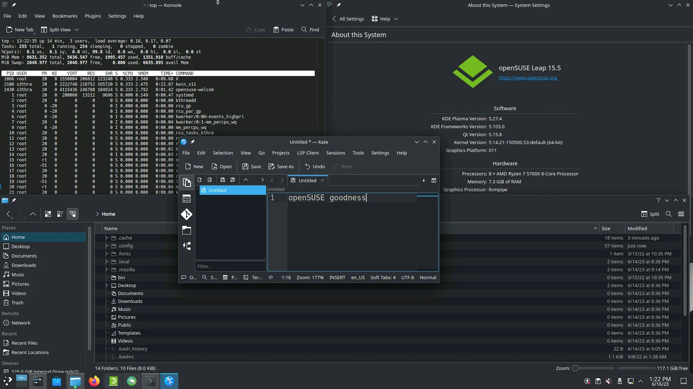

# Choosing Your Linux Distro: A High-Resolution Comparison

So you’ve decided to explore Linux—or maybe you’re trying to escape Windows drama or dodge the Apple tax. Good call. But now the inevitable question: **which Linux distribution is right for you?**

This guide breaks down five of the most robust, well-supported Linux distros on Earth. No weird side projects. No dead ends. Just the tried-and-true powerhouses: **Fedora, Ubuntu, Debian, openSUSE, and Linux Mint**.

We’ll compare them by user base, learning curve, system stability, hardware support, cloud and enterprise usage, software availability, and more. If you're in Kirksville or anywhere else wondering what Linux setup will actually work for *you*, this is the guide.

## TL;DR: Quick Comparison Graph

| Distro        | Ease of Use | Stability | Updates | Hardware Support | Enterprise/Cloud | Who It’s For                   |
|--------------|-------------|-----------|---------|------------------|------------------|--------------------------------|
| **Ubuntu**   | ★★★★★       | ★★★★☆     | ★★★★☆   | ★★★★★            | ★★★★★            | Beginners, developers, pros    |
| **Fedora**   | ★★★☆☆       | ★★★☆☆     | ★★★★★   | ★★★★☆            | ★★★☆☆            | Developers, open-source lovers |
| **Debian**   | ★★☆☆☆       | ★★★★★     | ★★☆☆☆   | ★★★★★            | ★★★★☆            | Admins, infrastructure nerds   |
| **openSUSE** | ★★★☆☆       | ★★★★☆     | ★★★★☆   | ★★★★☆            | ★★★★☆            | Admins, enterprise testers     |
| **Linux Mint** | ★★★★★     | ★★★★☆     | ★★★☆☆   | ★★★★☆            | ★★☆☆☆            | First-timers, casual users     |

Now, let’s break it all down.

---

## Ubuntu

### Why People Choose It
Ubuntu is the poster child for user-friendly Linux. With 6+ million active users and near-total dominance in the cloud, it’s the default choice for many. LTS (Long-Term Support) versions get 5+ years of updates and are widely trusted by pros and beginners alike.

### Key Traits
- **Ease of Use:** Excellent. Friendly installer, vast tutorials, smooth GUI.
- **Update Cadence:** Every 6 months (LTS every 2 years). Balanced pace.
- **Hardware Support:** Superb. Newest kernels and proprietary drivers.
- **Enterprise/Cloud Use:** Dominant on AWS, Azure, Google Cloud.
- **Security:** Fast patch delivery. AppArmor enabled. Canonical-backed.
- **Governance:** Canonical-led but with community involvement.

### Best For
New users, developers, sysadmins, anyone needing a stable, predictable OS with modern support.

---

## Fedora

### Why People Choose It
Fedora is fast, fresh, and open. It's where Red Hat and CentOS get their future tech. If you want to be on the cutting edge—but not fall off it—Fedora is ideal.

### Key Traits
- **Ease of Use:** Moderate. GNOME interface, modern but opinionated.
- **Update Cadence:** Every 6 months. Short 13-month support cycle.
- **Hardware Support:** Great for new gear. Not for 32-bit-only systems.
- **Enterprise/Cloud Use:** Indirectly through RHEL.
- **Security:** SELinux enabled by default. Quick to patch.
- **Governance:** Community-led with Red Hat sponsorship.

### Best For
Developers, testers, Linux tinkerers, and those who want Red Hat roots without the enterprise wallet.

---

## Debian

### Why People Choose It
Debian is rock-solid. It powers much of the internet and is the upstream for Ubuntu and Mint. If your motto is "I don’t want surprises," Debian delivers.

### Key Traits
- **Ease of Use:** Moderate to tough. Installer is plain but powerful.
- **Update Cadence:** Very slow. Stable releases every 2–3 years.
- **Hardware Support:** Legendary. Runs on everything—even 1990s hardware.
- **Enterprise/Cloud Use:** Widespread on budget-conscious infrastructure.
- **Security:** Transparent and thorough. Public security tracker.
- **Governance:** 100% community-run, democratic, decentralized.

### Best For
Admins, infrastructure architects, and people who value stability over flair.

---

## openSUSE (Leap and Tumbleweed)

### Why People Choose It
openSUSE gives you choices. Leap is the polished, slow-and-steady version aligned with SUSE Enterprise. Tumbleweed is a rolling release with surprising stability.

### Key Traits
- **Ease of Use:** YaST makes configuration easy. Good desktop polish.
- **Update Cadence:** Leap = yearly minor releases. Tumbleweed = constant.
- **Hardware Support:** Broad. Backported kernels help newer CPUs.
- **Enterprise/Cloud Use:** Strong via SUSE; Leap feeds into SLES.
- **Security:** Strong testing via openQA. Snapper for rollback.
- **Governance:** Board-elected, SUSE-supported.

### Best For
Sysadmins, testers, and tinkerers who want a clean UI and solid engineering.

---

## Linux Mint

### Why People Choose It
Linux Mint is Ubuntu’s calm, cinnamon-scented cousin. It’s the most beginner-friendly Linux desktop for people who just want stuff to work without the weirdness.

### Key Traits
- **Ease of Use:** Excellent. Cinnamon feels like Windows.
- **Update Cadence:** Slow. Based on Ubuntu LTS (2-year rhythm).
- **Hardware Support:** Solid. Includes codecs, printers, and Wi-Fi out of the box.
- **Enterprise/Cloud Use:** Minimal to none.
- **Security:** Inherits Ubuntu’s. Conservative update manager.
- **Governance:** Led by a small team, community influenced.

### Best For
Windows refugees, casual users, grandparents, and people who want to skip the nerdy stuff.

---

## Still Not Sure? Ask Yourself:
- Do I want maximum stability with minimal surprises? → **Debian**
- Do I want a desktop that feels like Windows? → **Mint**
- Do I want the safest bet for general use? → **Ubuntu**
- Do I want cutting-edge tech and don’t mind a bit of risk? → **Fedora**
- Do I want something a little different, but still solid? → **openSUSE**

For most Switchboard customers, Ubuntu or Mint is a fantastic starting point. You can always graduate to something deeper later.

Ready to install? [Check our setup guide →](/linux-distros/setup-guide)

