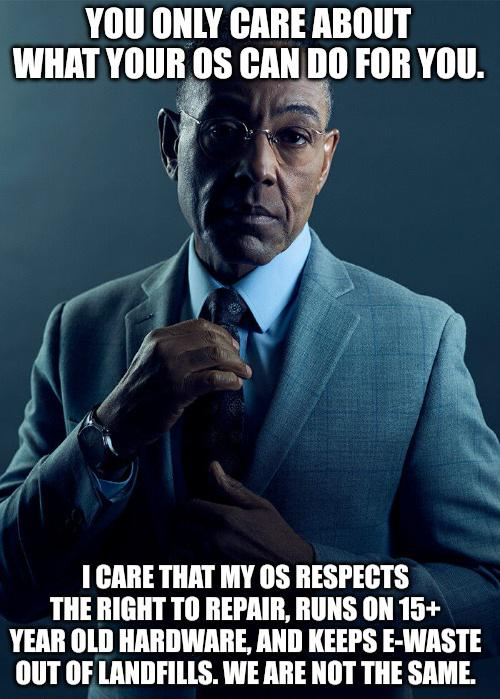

The other day I saw this classy meme on the [r/linuxsucks](https://www.reddit.com/r/linuxsucks/) subreddit. 

I like to read the conversations there, mostly because it baffles me how people can take such a powerful, scientifically advanced system—one that unselfishly serves so many of society’s needs—and say, "it sucks."

Sometimes I wonder if it’s meant to be a joke subreddit, a kind of parody designed to provoke strong counterarguments that ultimately make the OS better. But no, it’s usually a crowd of "It doesn’t handle Nvidia as well as Windows" or "I can’t do multiplayer games on it" people.

(By the way, Linux does handle games quite well in many cases.)

Anyway, here’s a breakdown of what that meme is really saying:

| Mentality            | Proprietary defaults (Windows, macOS)  | Open systems (Linux, BSD)                  |
| -------------------- | -------------------------------------- | ------------------------------------------ |
| Design goal          | Reduce friction, grow sales            | Increase control, grow skill               |
| Hardware cycle       | Frequent upgrades feel normal          | Old hardware stays useful                  |
| Repair culture       | Locked parts, licensed tools           | Documented fixes, community help           |
| Data stance          | Heavy telemetry, cloud by default      | Local first, opt in telemetry              |
| Costs over time      | Cheap now, pay later in hardware churn | Time investment upfront, savings long term |
| Environmental impact | More e-waste by replacement            | Less e-waste by repair and reuse           |
