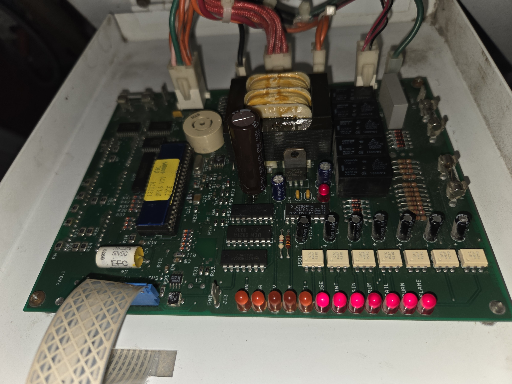
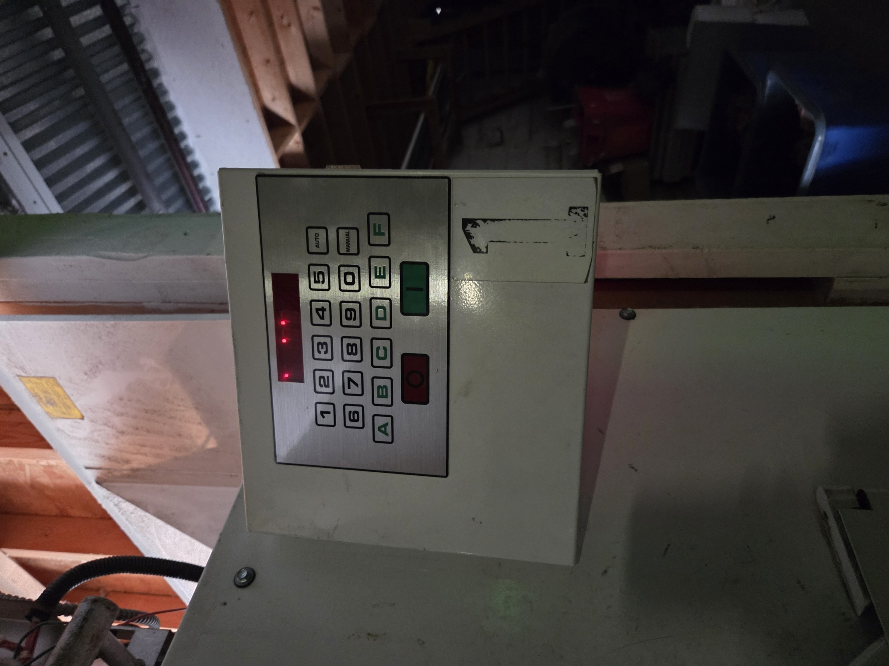
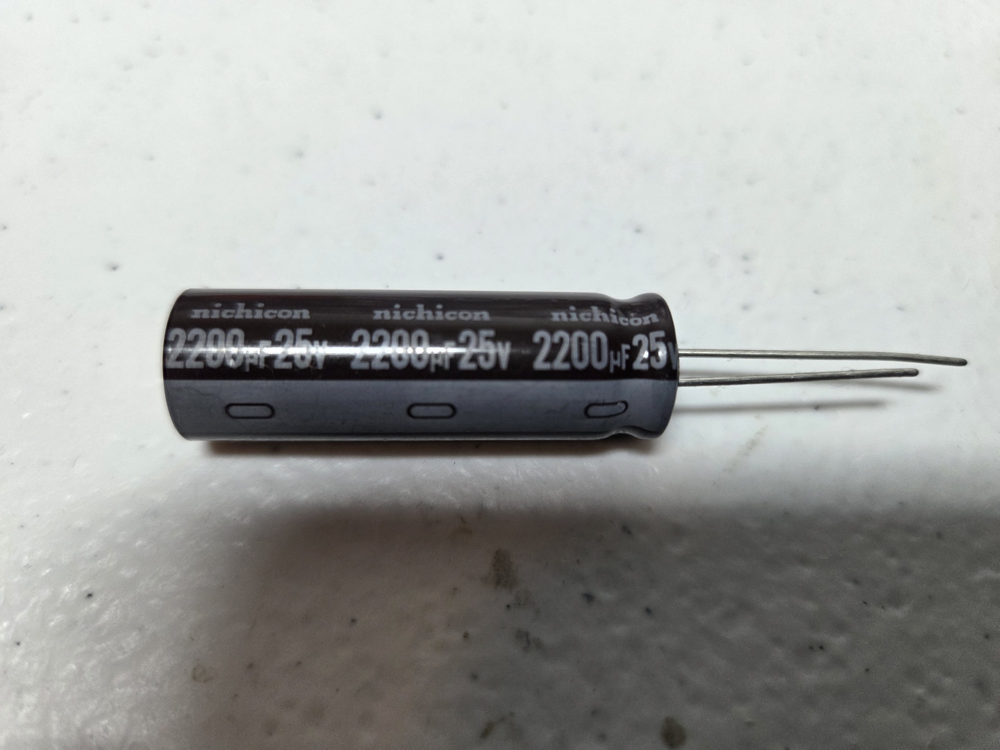

## Problem / Fix - Dryer from Early 2000s 🛠️

Older hardware is often easier to diagnose since the components are larger and the circuits are simpler.

The control board's display would **flicker when the dryer got hot**, and the machine would malfunction around that time.

Wiggling the large **2200µF 25V capacitor** seemed to relieve the problem for a short time.

So, I replaced the capacitor with a suitable component from Digi-Key ( [https://www.digikey.com/en/products/detail/nichicon/UPM1E222MHD/2599588](https://www.digikey.com/en/products/detail/nichicon/UPM1E222MHD/2599588) ), and the problem is officially **fixed**!

The dryer now runs stable.

## Why the Capacitor? 💡

Since this dryer is from the early 2000s, [back when **capacitor production was still a tad unstable**](https://en.wikipedia.org/wiki/Capacitor_plague), it was likely due for a change years ago.

As electrolytic capacitors age, the fluid inside them starts to change, and their values **drift**. This compromises the stability of the power supply.

**Solved!**

