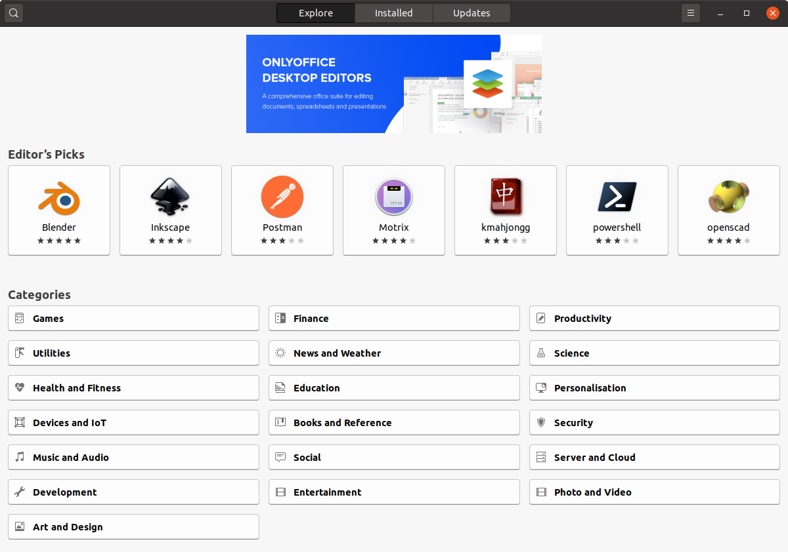

# Is It Hard to Switch to Linux? Not Really.

If you know how to use a mouse, type on a keyboard, and open a browser, you already know 80–90% of what it takes to move to Linux. Seriously. This isn’t a leap into hardcore command-line wizardry (though you can go there if you want). It’s a lateral move in terms of everyday computing—and in many cases, a smarter and more secure one.

---

## You’re Already Doing Most of the Work

Let’s start with what you spend your time doing: web browsing, email, streaming video, social media, maybe a bit of light office work. 

According to global usage data, the average desktop user spends about **6.7 hours per day** inside a web browser. Browser market-share shows **Google Chrome** dominating around **67%** of the market, with Firefox, Edge, and others making up the rest. 

Here’s the kicker: when you switch to Linux, those same browsers show up — Chrome, Firefox, Edge (via Chromium) — and they behave exactly the same. Your Google Docs, YouTube, Facebook, and streaming services all run under Linux. 

If you spend most of your day inside a browser, the transition is nearly invisible.

> [PRO TIP: Try out Brave Browser](https://brave.com/)

## Installing Software: The Safer, Simpler Way



On Windows, the usual flow is: download an installer from somewhere, hope it isn’t bundled with extra junk, click “Next” a few times, maybe restart. 

On Linux, the paradigm shifts: you use a **package manager** — a built-in library of trusted software.

- **Ubuntu** uses `apt` (Advanced Package Tool).
- **Fedora** uses `dnf`.

These manage dependencies, updates, and security for you. You install or remove an app in one line or via a simple GUI. No random websites, no hidden adware. Because of this model, Linux systems account for **less than 2% of all desktop malware detections** reported worldwide in 2025.

Fewer downloads. Fewer surprises. More control.

---

## The “Hard” Part — Which Isn’t Actually Hard

There *are* differences when you switch to Linux, but they’re the kind that make sense once you see them.

### Filesystem and Layout
Windows hides a lot of things — Program Files, AppData, the registry. Linux presents a simple structure:
- `/home/username` for your data
- `/etc` for system settings
- `/usr` for program files

Once you get used to this, you’ll see how tidy and logical it is.

### Updates and Maintenance
In Linux, system updates include both the OS and installed software. You won’t need to update every app separately. Fewer pop-ups, fewer “Restart required” nags.

### Hardware and Performance
Linux often runs faster on older hardware. A five-year-old laptop that struggles under Windows can feel new again with a lightweight Linux distro.

### Drivers and Devices
Most modern Linux distributions handle hardware automatically. Wi-Fi, graphics, printers — often plug-and-play. For rare devices that need setup, community guides are plentiful and clear.

---

## Do You Have to Use the Terminal?

No. You can do nearly everything through menus and apps.  
But the terminal gives you *power*. It’s like learning a few keyboard shortcuts that make life faster.

Example:
```
ls           # list files
pwd          # show current location
cd ~/Documents  # go to your Documents folder
sudo apt update   # refresh package lists
sudo apt upgrade  # install updates
```

You can skip it entirely — but eventually, you’ll probably prefer it.

---

## The Hidden Advantages You Might Not Realize

- **Security:** Linux’s user permissions and package system make mass malware attacks rare.  
- **Cost-Free Software:** Nearly all Linux distros and apps are free.  
- **Customization:** Choose your desktop environment — GNOME, KDE Plasma, XFCE — and make it your own.  
- **Performance:** Runs lean, often extending hardware life.  
- **Community Support:** Massive online forums and documentation. Type “how to ___ on Ubuntu” and you’ll find an answer.

---

## Why People Hesitate — And How to Overcome It

**“I’ll lose my files and programs.”**  
You can dual-boot or migrate files easily. Most web apps work across all operating systems.

**“What about my favorite software or games?”**  
Browser apps? No problem. Windows apps? Use **Wine** or **Proton** for gaming. The gap keeps closing.

**“Will my hardware work?”**  
Most likely yes. Linux’s kernel supports thousands of devices right out of the box.

**“The terminal scares me.”**  
It’s optional — but once you learn a few commands, it’s faster than any file browser.

---

## Real-World Examples

1. [Westcliff High School for Girls Academy (UK) – Ubuntu/KDE migration](https://opensource.com/education/13/7/linux-westcliff-high-school)  
   A school in England switched student-facing computers to Linux (KDE on Ubuntu) and reported improved stability and manageability.  

2. [Colegio Agustinos de León (Spain) – 120 computers migrated to Ubuntu 14.04](https://itsfoss.com/spanish-school-ditches-windows-ubuntu/)  
   After switching to Linux, the school reported a 63% technical-issue reduction overall and 90% in labs, and saved around €35,000 in licensing in one year.  

3. [Weißenburg Schools (Germany) – LEAF OS thin client solution on Linux base](https://www.ncomputing.com/blog-post/case-study-leaf-os-enables-virtualized-learning-and-cost-savings-wei%C3%9Fenburg-schools)  
   Repurposed older hardware with a Linux-based thin-client OS, reduced boot times, admin overhead, and improved teacher time.  

4. [City of Munich (Germany) – LiMux project, migrating desktops to a Linux-based system](https://en.wikipedia.org/wiki/LiMux)  
   Over 15,000 desktops migrated; savings reported around €11.7 million; increased freedom from vendor lock-in.  

5. [Schools in South Tyrol (Italy) – FUSS GNU/Linux in schools](https://interoperable-europe.ec.europa.eu/collection/open-source-observatory-osor/document/upgrade-freedom-schools-south-tyrol-have-their-own-gnulinux-distribution)  
   Entire regional school system chose a custom GNU/Linux distribution rather than upgrade Windows, many older machines reused.  

6. [Governments and public sector – various countries switching to Linux/open source](https://www.lpi.org/value-of-certification/government/)  
   Many examples of government agencies moving desktops or servers to Linux, citing independence, cost savings, transparency.  

7. [Case study: Open-source software in schools (UK, 2005) – cost savings via Linux/OSS desktop deployments](https://oss-watch.ac.uk/studies/external/becta_oss_2005_case_study.pdf)  
   Early research showing schools extending life of old PCs via open-source OS and thin clients.  

8. [Spanish autonomous region Extremadura – Linux adoption in schools and offices](https://news.ycombinator.com/item?id=16734185)  
   Though older, this example shows large-scale open-source deployment in rural public sector to reduce costs.  

9. [University of North Carolina – departmental server migration to Linux](https://ils.unc.edu/MSpapers/2937.pdf)  
   Illustrates even academic departments switching mission-critical systems to Linux, not just desktops, showing confidence in the platform.  

10. [Small-business/home user anecdotal story: “A hardcore Windows guy switches to Ubuntu”](https://www.davidalison.com/2008/02/hardcore-windows-guy-switches-to-ubuntu.html)  
    A personal blog of a longtime Windows user switching to Ubuntu, showing that even individuals make the jump.  


---

## Final Thought: So Why Are You Still on Windows?

If you can browse, click, and type, you can use Linux. It’s faster, cleaner, and more transparent. You get security, privacy, and freedom — no bloat, no “Your PC will restart in 15 minutes” pop-ups.

You don’t need to be a geek. You just need curiosity and an hour to explore.  
You might find that Linux feels less like a leap... and more like coming home.

---



---

*Written by Switchboard Tech Services LLC — independent computer repair and Linux support. Helping users and small businesses explore open-source technology across Northeast Missouri and beyond.*
