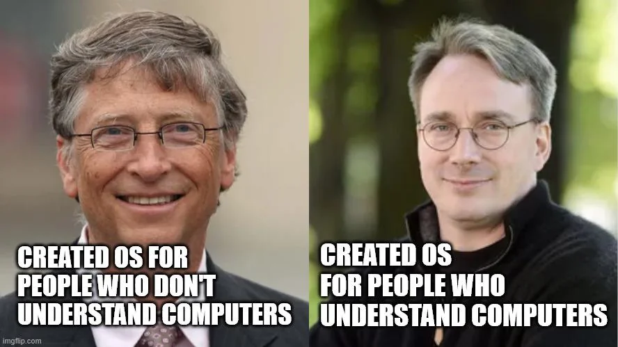
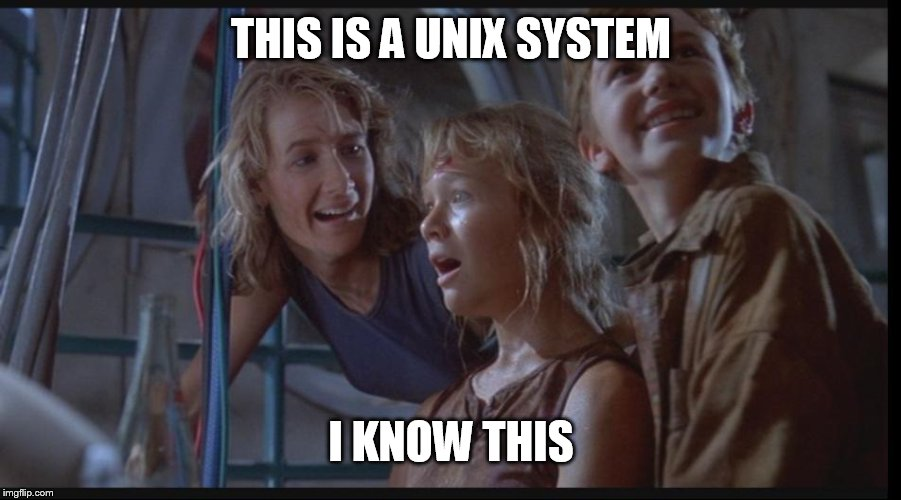

Many schools still rely on Windows by habit, but a closer look at history reveals how Linux quietly became the backbone of modern computing—and why it may be the smarter choice for today’s classrooms.

The meme below is good for a laugh, but only half right. In truth, it captures where things started, not where they have to end. The history behind it tells a much larger story -- one that shows how our classroom computers evolved, and how, today, schools can choose a path that’s more affordable, open, and empowering than ever before.

> Meme seen in the wild:  
> Left photo: "Created OS for people who do not understand computers."  
> Right photo: "Created OS for people who understand computers."

Fun, but wrong in a helpful way.

## Quick correction (so we can move on)
- Windows, as we know it today, runs on the Windows NT family designed by Dave Cutler and a large engineering team. Bill Gates led the business strategy that put Windows on nearly every PC.
- Linux is not an operating system by itself; it is the kernel. A full Linux system is the kernel plus userland tools (often from GNU) and a desktop environment. That bundle is what you install on a laptop.

Now to the useful bit for teachers in Kirksville and the surrounding NEMO districts.

---

## The fork in the road: appliance vs. instrument

- Windows evolved to hide complexity and deliver fast, predictable results on mass-market hardware. It turned computers into appliances.
- Linux evolved to expose control and invite learning. It treats a computer like an instrument you can tune.

Both approaches have value in a school. The question is where each belongs in 2025 and onward, given budgets, testing, and what we actually want students to learn.

---

## What Windows does well in schools
- Familiar defaults. Most students have seen Windows at home or at work sites.
- Commercial software catalogs. If a program is Windows-only, there is no debate; it needs Windows or a workaround.
- Directory and policy tooling. AD and existing domain policies are entrenched in many districts.

These strengths made Windows the default in our region. Defaults are comfortable, but they are not always optimal.

---

## What modern Linux brings to classrooms
- Cost control. No per-seat OS licensing. Many core apps are free and maintained by universities and nonprofits.
- Performance on older devices. Lightweight Linux desktops can extend the life of machines that feel slow on Windows.
- Fewer forced interruptions. No ad tiles in the Start menu, fewer surprise restarts, simpler privacy settings.
- Real computer literacy. Students can see how a system is assembled, explore a terminal safely, and connect what they see to STEM concepts.
- Local repairability. Most problems are fixable with community documentation; parts and knowledge compound over time.

Think of it this way: Windows optimizes for frictionless consumption; Linux optimizes for transferable understanding.

---

## The invisible truth students should know
Linux already runs the world students use -- Android phones, servers, routers, supercomputers, and the cloud. Teaching with Linux in one lab isn’t fringe; it’s giving students a passport to the infrastructure that keeps the modern world running.

---

## A NEMO-friendly pilot plan (one lab, one semester)

1) Pick a purpose
- Digital literacy, CS intro, robotics, or media lab. Tie the switch to a course outcome.

2) Choose a teacher-friendly distro
- Linux Mint or Ubuntu LTS for general classrooms.
- Elementary OS for a Mac-like feel.
- Fedora Workstation for up-to-date CS courses.

3) Set the apps  
- Office: [LibreOffice](https://www.libreoffice.org).  
- Browsers: [Firefox](https://www.mozilla.org/firefox/), [Chromium](https://www.chromium.org/).  
- Creativity: [Krita](https://krita.org/), [Inkscape](https://inkscape.org/), [Audacity](https://www.audacityteam.org/), [Kdenlive](https://kdenlive.org/).  
- STEM and CS: [Scratch](https://scratch.mit.edu/), [Thonny (Python)](https://thonny.org/), [Arduino IDE](https://www.arduino.cc/en/software), [Geogebra](https://www.geogebra.org/), [Octave](https://octave.org/).  
- Testing: set up a separate Windows machine or VM where vendor portals require it.

4) Image and deploy
- Create one golden image with your chosen desktop and apps.
- Use [Clonezilla](https://clonezilla.org/) or [Ventoy](https://github.com/ventoy/Ventoy) on USBs to reprovision machines quickly.

5) Keep a Windows lifeboat
- For the rare Windows-only program, use one of:
  - A single Windows box in the room.
  - A district RDS/VDI session.
  - A small Proxmox or VirtualBox host.

6) Assess like a scientist
- Track machine uptime, restart frequency, student task completion time, and support tickets for the semester.
- Compare to last semester’s Windows baseline.

7) Share the story
- Let students present a short “What I learned switching to Linux” reflection. That is the literacy you want.

---

## Addressing the usual concerns

Q: State testing portals sometimes demand Windows or a specific browser.  
A: Keep a few dedicated Windows seats or provide a managed remote session. Use Linux for teaching days, Windows for the one test day.

Q: Our devices are old.  
A: Good. Linux shines there. Xfce or MATE desktops run well on 4 GB RAM and older CPUs.

Q: Teachers do not have time to relearn everything.  
A: The basic workflow is familiar: files, browser, office suite, printer. You can add terminal skills later as enrichment, not a gate.

Q: What about malware and student mischief?  
A: Linux limits damage by design. Standard student accounts and a package manager beat random .exe downloads any day.

---

## Budget snapshot for a 25-seat lab

This is a plain-English comparison for one lab over three years. Adjust to your reality.

- Windows path
  - OS licensing: paid or bundled with new machines.
  - Hardware: more frequent refresh to keep performance acceptable.
  - Software: recurring licenses for office, media, and utilities.
  - Hidden cost: downtime from forced updates and adware cleanup.

- Linux path
  - OS licensing: $0.
  - Hardware: extend life 2 to 4 years on many machines; repurpose retired staff laptops for student use.
  - Software: libre stack covers office, media, and STEM.
  - Hidden gain: students learn maintenance and troubleshooting as part of class.

Result: you buy fewer machines, keep more in service, and reallocate budget to peripherals that matter for learning (monitors, mics, cameras, microcontrollers).

---

## Pedagogy advantages you can feel in the room

- From user to investigator. Students move beyond “click the right icon” to “understand the system.”  
- Relevance to trades and university. Linux experience helps in [computer networking](https://en.wikipedia.org/wiki/Computer_network), [cybersecurity](https://en.wikipedia.org/wiki/Computer_security), [computer programming](https://en.wikipedia.org/wiki/Computer_programming), and [research laboratories](https://en.wikipedia.org/wiki/Laboratory).  
- Project-based learning. A [Raspberry Pi](https://en.wikipedia.org/wiki/Raspberry_Pi), a [LoRa](https://en.wikipedia.org/wiki/LoRa) board, a [3D printer](https://en.wikipedia.org/wiki/3D_printing), and [Linux](https://en.wikipedia.org/wiki/Linux) make a complete maker pathway without subscription walls.

---

## A thought experiment for class discussion

Alternate universe: IBM picked a Unix-like desktop in the 80s, and schools followed. By 2005 every student could use a terminal and a package manager. What would our digital citizenship look like today—more independent, less locked-down, and better at telling a computer what to do?

We cannot rewind history, but we can borrow that universe for one lab.

---

## Local help, minimal hassle

Switchboard Tech Services (Kirksville) can:
- Convert a cart of older laptops to a Linux teaching lab.
- Provide a ready-to-teach image with the apps listed above.
- Set up dual-boot or a Windows fallback as needed.
- Train staff in a single after-school session.
- Offer documentation written for teachers, not sysadmins.

---

## Messages worth hanging on the lab door

- Windows: pay to keep the hood closed.  
- Linux: open the hood, teach the engine, spend less each year.

If your goal is fast results with minimum thought, Windows works. If your goal is durable literacy, budget relief, and student confidence with real systems, Linux belongs in the schedule.



---

## ENDNOTE: Schools That Switched from Windows/macOS to Linux

### 1. Westcliff High School for Girls — Southend, UK  
**Type:** Secondary grammar school  
**Summary:** Migrated ~400 PCs from Windows XP to openSUSE with KDE in 2012.  
**Reason:** Avoided expensive hardware refresh and licensing; fit new UK computing curriculum focused on digital literacy.  
[Read the case study](https://interoperable-europe.ec.europa.eu/news/linux-school-case-study-westcliff-high-school-girls-2013-03-19_en)

### 2. Penn Manor High School — Pennsylvania, USA  
**Type:** Public high school  
**Summary:** Issued 1,725 Ubuntu laptops to all students in 2014, fully replacing Windows/macOS systems.  
**Reason:** Encouraged open exploration (sudo access); saved $360,000; avoided vendor lock-in.  
[Full story via Linux Foundation](https://www.linuxfoundation.org/blog/blog/penn-manor-school-districts-open-source-journey)

### 3. Colegio Agustinos de León — León, Spain  
**Type:** K–12 private school  
**Summary:** Migrated 120 PCs to Ubuntu 14.04 in 2014 after Microsoft ended XP support.  
**Reason:** Upgrading to new Windows was too costly; Linux provided long-term support and flexibility.  
[Source article](https://itsfoss.com/ubuntu-schools-spain/)

### 4. Kerala Public Schools — Kerala, India  
**Type:** 14,000+ government K–12 schools  
**Summary:** Adopted IT@School Linux (now KITE GNU/Linux) on 200,000+ machines by 2019.  
**Reason:** Saved ₹3,000 crore (~$428M) in license costs; emphasized software freedom.  
[Coverage from The News Minute](https://www.thenewsminute.com/article/why-kerala-using-linux-schools-and-not-windows-119055)

## Schools That Started with Linux

### 1. Immaculate Heart of Mary School — Monona, Wisconsin, USA  
**Type:** K–8 Catholic school  
**Summary:** Switched entirely to Linux around 2000, running desktops, servers, and phones on open source.  
**Reason:** Licenses cost more than hardware; Linux enabled privacy, customization, and self-reliant IT.  
[Interview at opensource.com](https://opensource.com/education/14/6/small-school-big-open-source-dreams)

### 2. Yogyakarta Province Linux for Education Program — Indonesia  
**Type:** Regional K–12 school initiative (~500 schools)  
**Summary:** Adopted openSUSE Edu Li-f-e across classrooms since 2010, using thin clients and Moodle servers.  
**Reason:** Out-of-box Linux solution reduced complexity and cost while expanding access to educational software.  
[Details from openSUSE News](https://news.opensuse.org/2010/09/01/opensuse-edu-in-500-indonesian-schools/)

