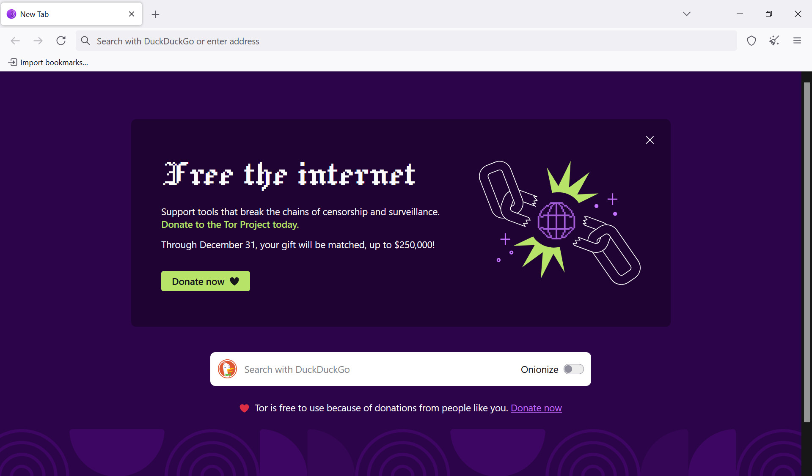

A metaphorical but real introduction to [TOR browser](https://www.torproject.org/download/):

## Knowledge is Freedom

The world didn’t flip overnight--it shifted bit by bit. The systems and programs we once relied on have been reshaped to serve themselves, using us more than we use them. What once felt like tools have become exploiters.

Mainstream technology still dazzles us, but beneath the charm lies control. It is, in many ways, engineered to drain rather than empower.

In this landscape, ignorance is a leash. Knowledge is the key that cuts it loose.

## The Surveillance Ecosystem of Software and Services

Late-stage capitalism has, over time, produced a culture where ravenous opportunism is treated as a virtue. As you search the web, stream movies, and chat with friends, every action is quietly harvested and stored in vast corporate databases. Out of these fragments, a second self is constructed--a virtual double, built from the DNA of your clicks, habits, and inner life.

This replica is not benign. It is leveraged to exploit you in ways both subtle and overt. And in darker times--darker even than these--who can say what further purposes it might serve?

"I have nothing to hide," some people say. A clean conscience is good to have. But the danger isn’t in your actions--it’s in theirs. Surveillance isn’t about exposing your secrets; it’s about giving powerful systems leverage over you, whether you’ve done anything wrong or not.

### 1. How tracking and surveillance work online
- When you visit a website or use an app, it often embeds **first-party** tracking (the site itself gathering your data) *and* **third-party** tracking (external services your site includes). ([FTC](https://consumer.ftc.gov/articles/how-websites-apps-collect-use-your-information?utm_source=chatgpt.com))  
- The tools include:  
  - Cookies (small files stored on your device that identify you or your device) ([Firewall Times](https://firewalltimes.com/how-companies-track-you-online/?utm_source=chatgpt.com))  
  - Browser or device fingerprinting (identifying you by a combination of device/browser settings even if you delete cookies) ([Global Cybersecurity Network](https://globalcybersecuritynetwork.com/blog/understanding-online-privacy-how-companies-track-you-and-your-options/?utm_source=chatgpt.com))  
  - Tracking pixels, beacons, embedded scripts from ad networks that follow you across sites ([EFF](https://www.eff.org/issues/online-behavioral-tracking?utm_source=chatgpt.com))  
  - Cookie syncing: separate tracking services "match up" their identifiers so one profile gets tracked across many domains. ([Wikipedia](https://en.wikipedia.org/wiki/Cookie_syncing?utm_source=chatgpt.com))  
- The result: every click, search, app-use, location ping, even time spent reading, can feed into a profile of you (or at least "someone like you"). ([EPIC](https://epic.org/issues/consumer-privacy/online-advertising-and-tracking/?utm_source=chatgpt.com))  
- That profile is then used for many downstream purposes: targeted advertising, dynamic pricing, credit/lending decisions, even law-enforcement or government surveillance. ([TechEquity](https://techequity.us/2025/08/05/surveillance-economy/?utm_source=chatgpt.com))  

---

### 2. The giant harvesting companies and how they keep the "virtual you" in play
- Big tech platforms (search engines, social networks) and data-broker firms are the main harvesters. ([arXiv](https://arxiv.org/abs/2508.07454?utm_source=chatgpt.com))  
- Data brokers collect, merge, and sell data. The industry is valued at around **$389 billion**. ([TechEquity](https://techequity.us/2025/08/05/surveillance-economy/?utm_source=chatgpt.com))  
- Example: Oracle bought Datalogix (tracking offline purchases) and used it to enhance online ad profiles. ([Wired](https://www.wired.com/2014/12/oracle-buys-data-collection-company-datalogix?utm_source=chatgpt.com))  
- Surveillance isn’t just ads: location data apps, health/finance trackers, and inter-device linking all contribute to a "data double." ([Wikipedia](https://en.wikipedia.org/wiki/Fog_Reveal?utm_source=chatgpt.com))  

---

### 3. Why this matters
- Your "virtual you" is built from fragments -- but the whole is powerful. It can influence what prices you see, what ads follow you, what loans you get, or how you’re judged in opaque systems. ([Global Cybersecurity Network](https://globalcybersecuritynetwork.com/blog/understanding-online-privacy-how-companies-track-you-and-your-options/?utm_source=chatgpt.com))  
- Ignorance here isn’t just inconvenient: it’s potentially **enslaving**.  
- The "tool uses you" rather than "you use the tool": systems are engineered so that your activity feeds them, not the other way around.  
- Because these profiles are built without your full consent, they can be repurposed--into surveillance, profiling, or discrimination.  

---

### 4. What to watch out for
- Even "innocent" websites share data with hundreds of partners: some with **1,000+ companies**. ([Wired](https://www.wired.com/story/cookie-pop-up-ad-tech-partner-top-websites?utm_source=chatgpt.com))  
- Review app permissions carefully: location, contacts, identifiers are valuable. ([Global Cybersecurity Network](https://globalcybersecuritynetwork.com/blog/understanding-online-privacy-how-companies-track-you-and-your-options/?utm_source=chatgpt.com))  
- Use privacy-conscious tools: browsers/extensions that block trackers, privacy-first search engines.  
- Clear cookies, use anti-fingerprinting tools; but know some tracking methods are highly persistent.  
- Push for regulation and transparency: companies are slowly being forced to disclose data practices, but safeguards remain weak. ([Kellogg Insight](https://insight.kellogg.northwestern.edu/article/consumer-data-protection?utm_source=chatgpt.com))  

## Become a Wary Creature of the Night  

It’s time to learn new skills--and our introduction will be brief.  

Meet **Tor**, the Onion Browser. With Tor, you take on the vision of the owl: watchful, silent, unseen. Your passage through the web leaves no trail, no flutter, no cry. While ordinary users scatter like noisy pigeons, visible from every angle, you glide with quiet precision.  

No longer caught in the corporate glare, no longer easy prey--you move apart from the flock. In the shadows, you are free.  

---

## Entering the Shadows: Downloading Tor  

To cloak yourself, begin at the only trusted source: [the Tor Project](https://www.torproject.org/). The download is simple, but beware of imitators. Only the official site offers the true key. The bundle installs like any other browser, yet behind its ordinary window lies a network of layered relays--the onion’s skin, wrapped over itself again and again, obscuring your origin.  

---

## Moving in Silence: How to Use It  

Once inside, the experience feels familiar: a web browser, a search bar, your favorite pages. Yet every click is routed through a chain of encrypted relays, each peeling back one layer but never revealing the whole. The sites you visit see only the last relay, not you. Your footprints are swept away behind you.  

Browse deliberately. Open new identities as you would don fresh cloaks. Treat each session as a chapter, distinct and unlinked.  

---

## Wisdom of the Hunter: Caution  

But do not mistake invisibility for invulnerability. Like any powerful tool, Tor can be misused--or used against the careless. Logging into personal accounts can pierce your veil. Installing unsafe plugins or sharing details that identify you can shatter your anonymity. The owl sees in darkness, but it is still flesh and feather. Vigilance must be your companion.  

---

## A Guiding Star: DuckDuckGo  

Tor integrates with [DuckDuckGo](https://duckduckgo.com/), the search engine that refuses to track. It is a perfect partner--light in the dark, guiding your path without feeding your shadow-double to data harvesters. A symbiosis of stealth and discretion.  

---

## Safe or Dangerous: The Choice Is Yours  

Tor is a paradox. It can be one of the safest tools on Earth--granting voice to whistleblowers, privacy to citizens under watch, freedom to those in suffocating regimes. But used recklessly, it can expose you faster than any pigeon in the square. The line between safe and dangerous is drawn not by Tor, but by you.  

---

## Knowledge Is Power. Power Is Freedom.  

What matters most is understanding. To know how you are watched is to weaken the watcher. To know how to cloak yourself is to reclaim autonomy. Knowledge of these tools grants power--but it must be handled wisely, like fire in the forest.  

---

## Benefits of Using Tor  

- Protects your privacy by obscuring your IP and location.  
- Blocks trackers that follow your every step.  
- Circumvents censorship and allows open access to information.  
- Creates safety for journalists, activists, and ordinary citizens alike.  
- Offers a taste of what the internet was meant to be: free, borderless, and unbound.  

---

## Walking Through the Forest  

To use Tor is to walk once more on the endless trail. The cedars rise, the sawdust path stretches, and danger lurks unseen. Yet you stride forward, calm and confident. You are no longer the hunted--you are the free man walking through dangerous territory with ownership of self.  

  
