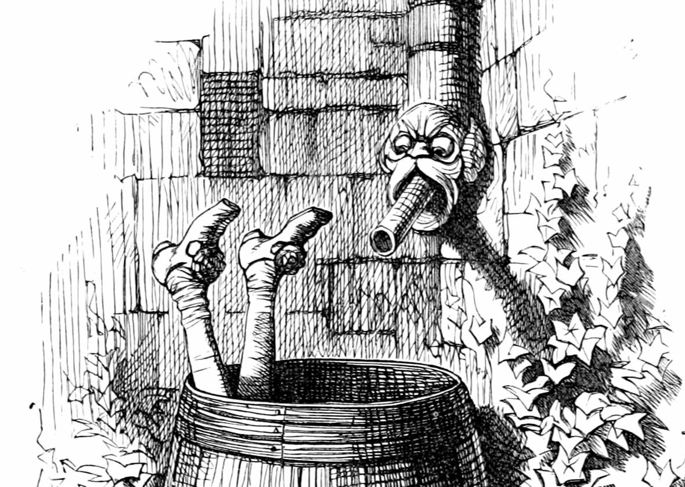
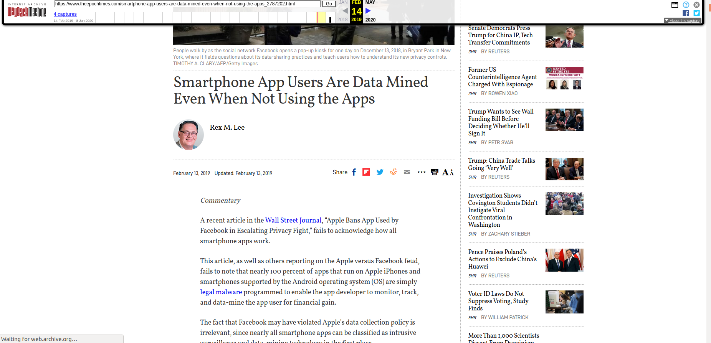
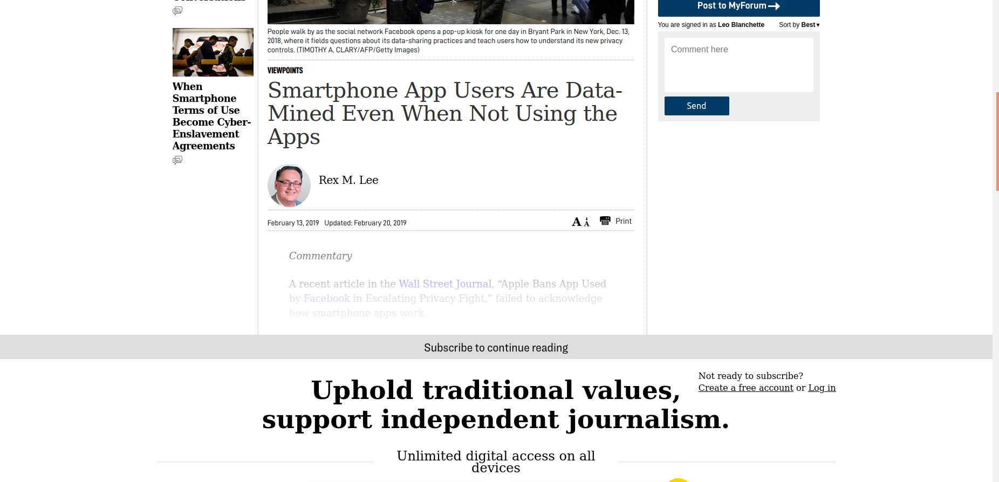

# Back in 2020…

In September 2020 I published this piece on my old Hawaii GenTech blog. At the time, it was a personal observation about link rot and instability.  

Here is the article: https://web.archive.org/web/20200908080632/https://hawaiigentech.com/post/commentary/why-i-link-to-waybackmachine-instead/ 

I argued that **the live web couldn’t be trusted**--links die, content changes, and what you cite today may vanish tomorrow.  

That was before the tidal wave of AI spam, paywalled content, and the accelerating decay of online archives. What felt like an eccentric worry in 2020 has turned into everyday reality in 2025.  

Below, I’m republishing that original article in full, preserved from the Wayback Machine.  

---

# The Perfect Article (2020 Original)

---

When linking to a page for the **purpose of reference**, it seems better to me to **link to the [archive](https://archive.org/)** of a given page, rather than to the original site itself.

This ensures that after some years have gone by, **my article is guaranteed to be consistent**. Due the changing nature of the web, there is a chance that after some years, the link could lead to a:

- 404 / Not Found (most common)  
- Changed or edited content, or entirely replaced content  
- Content that, due to a rise in popularity, is now shielded, demanding the user to make an account to read the entire article.  

---

## Linking to an archive is probably more authoritative than linking to unstable dynamic web content.

Take defensive measures. To future-proof your content, rather than reference the general web, it’s far more reliable to link to an archive.  

---

## Example

The *Epoch Times* wrote an article on smartphones data-mining their users. This is the archived article here:  
[The Archive Version (fully readable)](https://web.archive.org/web/20190214015500/https://www.theepochtimes.com/smartphone-app-users-are-data-mined-even-when-not-using-the-apps_2787202.html)

### Article Content Before

You can see its perfectly “normal” readable useful content.  

### Article Content After

Now it’s spam from a site suffering financial need.  

So in Feb 14 2019 your users would have seen the content you intended. However in Sep 07 2020, your users are being asked to support independent journalism instead.  

---

## If an Archive Record Doesn’t Exist, Make One

It’s worth the extra moment, in referencing a site, to make an archive of the page you wish to reference, if one does not exist. After that, immediately use the link from the archive.org entry, rather than the blog, news, info, or forum site you wish to refer to.  

---

## In Unstable Times, Take Measures for Stability

The web is a fast changing place. Even more during the Covid pandemic and suffering financial markets. Since times are financially harder, websites are disappearing, heaping up advertising, demanding user response, and things like this.  

To avoid your content losing quality due to these things, linking to a solid, unchanging static copy of the page is far more reliable.  

---

*Author: Leo Blanchette, September 7, 2020 -- Hawaii GenTech*

---

# The Conclusion (2025)

Looking back, the article feels prophetic. The warning signs were already there in 2020.  

Now in 2025, we’ve added new layers of decay:  
- AI-generated junk pages.  
- “Ephemeral” social posts that vanish or rewrite history.  
- Government and corporate sites that change silently without accountability.  

The principle hasn’t changed--it has only grown stronger:  

**If you care about your readers, your citations, or the integrity of your work, link to the archive. Not the swamp.**  

