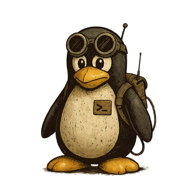

# The AltGrid Project

AltGrid builds **tools for the world after the grid** — when cloud services fail, networks fragment, and simplicity wins.  
It’s a family of open projects focused on one guiding idea: that technology should keep working even when the internet doesn’t.

AltGrid systems are designed around **Simplicity · Portability · Autonomy**.  
They favor text over apps, terminals over touchscreens, and radio over Wi-Fi. Everything can be built, run, and repaired using ordinary Linux tools.

## Core Projects

- **[ViaText Core](https://github.com/AltGrid/viatext-core)** — Linux command-line toolkit for sending and receiving plaintext messages through LoRa radios.  
- **[ViaText Node](https://github.com/AltGrid/viatext-ttgo-lora32-v21)** — ESP32-based field hardware for off-grid communication.  
- **[AltGrid Live](https://github.com/AltGrid/altgrid-live)** — a portable Debian-based live OS that runs AltGrid tools entirely from a USB stick.

Together, they form a **self-contained communication network** — part radio, part post office, part act of defiance against disposable tech.

> Build like it’s 1986. Communicate like it’s 2086.

---

More posts under this section will explore the hardware, firmware, and philosophy behind the project — along with field experiments, design notes, and appearances by our mascot, **ViaTux**, the Linux survivalist of the post-cloud world.
