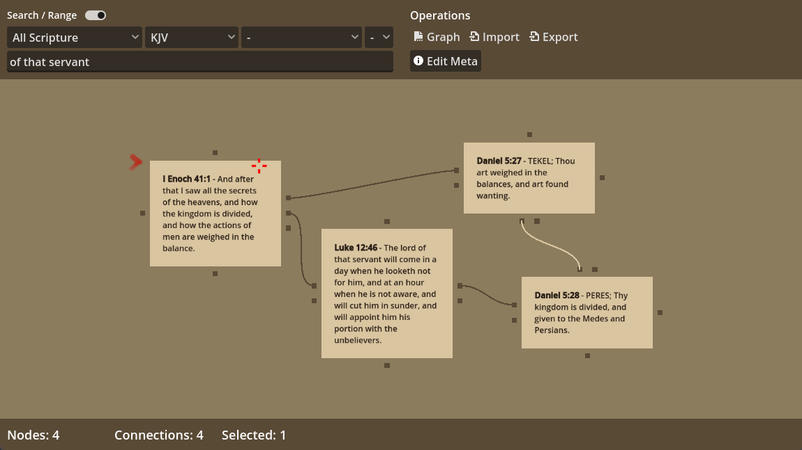

# Scrollmapper

Scrollmapper is a long-running open project dedicated to making **Bible text data freely accessible** in structured, developer-friendly formats.  
It is best known for its large set of **Bible databases**: full versions, deuterocanonical works, and extensive cross-references.

This is, to date, the largest contribution I’ve made to the internet: a set of repositories that together contain **hundreds of commits, thousands of verses, and multiple formats** designed for both research and application development.

## Repositories

- [**scrollmapper**](https://github.com/scrollmapper/scrollmapper) – The Scrollmapper App created in [Godot](https://godotengine.org/). Exists to read and map cannonical and losts texts.  
- [**bible_databases**](https://github.com/scrollmapper/bible_databases) – core database of Bible versions and cross-references, with 1.4k+ stars, ~440 forks, and 160+ commits.  
- [**bible_databases_deuterocanonical**](https://github.com/scrollmapper/bible_databases_deuterocanonical) – extended dataset including deuterocanonical books.  
- [**scrollmapper (organization)**](https://github.com/scrollmapper/) – the umbrella GitHub account hosting the project family.  

## Purpose

Scrollmapper exists to:

- Provide **open, structured text** for developers, researchers, and educators.  
- Enable **cross-referencing, search, and analysis** of scripture across traditions.  
- Preserve these texts in simple formats (SQL, JSON, CSV, etc.) for long-term use.  

---

Scrollmapper continues to grow as a community resource for anyone building tools, visualizations, or studies that rely on open Biblical text data.